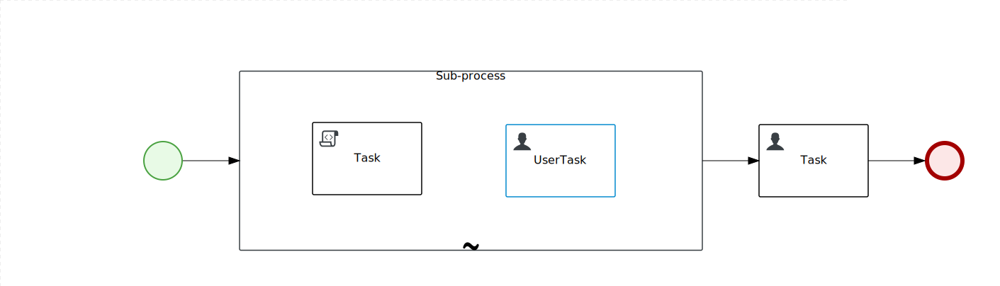

Ad-Hoc sub-process activation condition example
===============================================

Project contains two processes. **AdHocActivationTest** contains Ad-Hoc Activation Condition, **AddPersonToKieBase** contains script to trigger Activation Condition. Start **AdHocActivationTest** and keep it running. Start **AddPersonToKieBase** and provide name *Ivan* to trigger condition, any other string won't trigger Activation Condition.

Another example can be found here: https://github.com/wmedvede/AdHocActivationConditionTest
